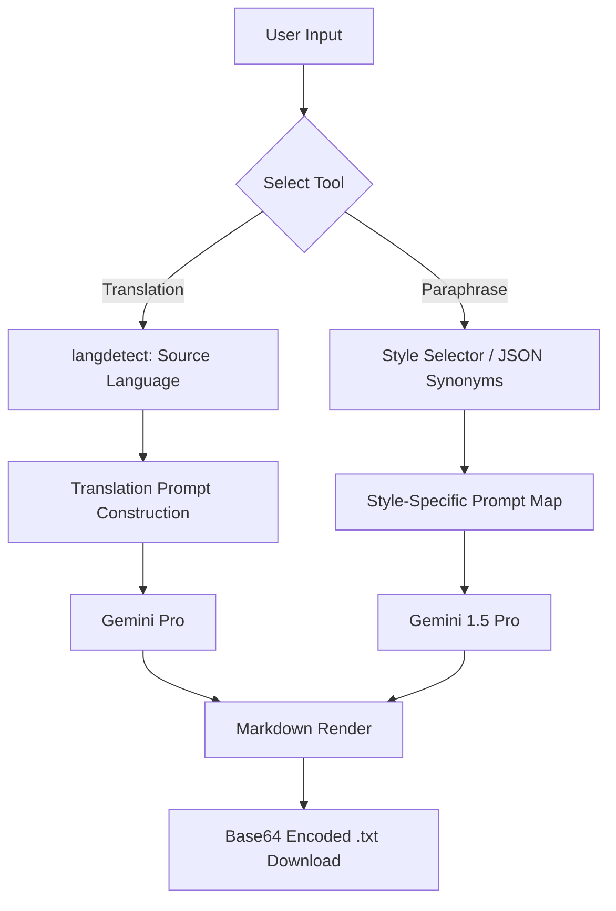

# 🌐 Multi-Modal Linguistic Intelligence Suite

This sophisticated application is an all-in-one linguistic processing hub that combines **Language Translation**, **Intelligent Paraphrasing**, **Citation Generation**, and **Neural Summarization**. By leveraging the **Google Gemini** family of models (`pro` and `1.5-pro-latest`), it provides high-fidelity text manipulation with a focus on semantic preservation and stylistic control.

---

## 🏗️ System Architecture

The application is built on a **Modular Micro-Interface Architecture**, where distinct linguistic tasks are handled by specialized logic modules but unified under a single Streamlit dashboard.

### 1. Linguistic Routing Layer
* **Mode Selection:** A centralized routing logic directs user input to one of three specialized "engines" (Translator, Paraphraser, or Summarizer).
* **Cross-Model Integration:** The system dynamically switches between `gemini-pro` for standard translation tasks and `gemini-1.5-pro-latest` for tasks requiring deep reasoning, such as academic paraphrasing and citation logic.

### 2. Multi-Input Normalization
* **Encoding Detection:** Utilizes the `chardet` library to analyze raw binary data from uploaded `.txt` files, ensuring that documents in various formats (UTF-8, ISO-8850, etc.) are correctly decoded before being sent to the AI.
* **Language Identification:** Implements `langdetect` to automatically identify the source language of input text, allowing the AI to adjust its translation profile without manual user intervention.

### 3. Logic & Reasoning Engines
* **Contextual Paraphraser:** Uses a "Prompt Map" strategy to inject specific stylistic constraints (e.g., "Witty," "Academic," "Optimistic"). It supports **JSON-based Synonym Injection**, allowing users to force the AI to use specific vocabulary.
* **Citation Automator:** A specialized knowledge engine that transforms raw text or bibliography info into structured formats like **APA, MLA, or Chicago**.
* **Zero-Shot Summarizer:** Employs a restrictive "Persona Prompt" that prevents the model from injecting bias or external information, ensuring the summary remains grounded only in the provided text.

---

## 🛠️ Tech Stack

| Component | Technology |
| :--- | :--- |
| **Cognitive Core** | Google Gemini (Pro & 1.5-Pro) |
| **Framework** | LangChain & Streamlit |
| **Language Logic** | `langdetect` & `chardet` |
| **Serialization** | JSON & Base64 (for file downloads) |
| **Styling** | Custom CSS & HTML-injected Streamlit components |

---

## 🧠 Functional Workflow

The system operates through a sequential data transformation pipeline:



### Advanced Translation Features
Unlike simple API calls, this system uses **Detection-to-Dictionary mapping**. It translates the raw detection codes (e.g., `en`) into human-readable names (e.g., `English`) before prompting the AI, which significantly reduces translation "hallucinations" in the target language.

### Specialized Styling
The UI is optimized for readability using **Custom Radio Button CSS**, transforming standard vertical radio lists into a modern, horizontal "segment" layout.

---

## 📊 Technical Specifications

### Data Persistence & Export
To ensure data privacy and convenience, the system generates **on-the-fly Base64 downloads**. This allows users to save their results as `.txt` files directly from the browser's memory without needing a backend database storage.

```python
# Base64 Download logic
href = f"data:file/txt;base64,{base64.b64encode(text.encode()).decode()}"
```

### Prompt Guardrails
The application uses a **Context-Locking** mechanism. For summarization and translation, the instructions explicitly state: *"Never answer any queries irrelevant to this context."* This prevents the model from being hijacked for non-linguistic tasks, ensuring enterprise-level security and consistency.

